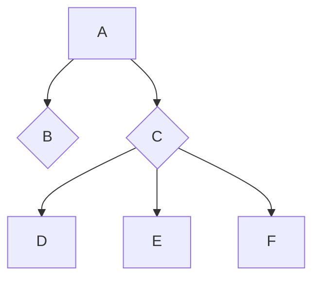

# AI-GameTreeSearch

## 算法原理

在**Game Theory**中，玩家不是同时做决策，而是有先后顺序的决策，这被称作**Dynamic Game**。

对于**Dynamic Game**，我们可以通过**Game Tree**来形象的进行建模，如下图：


Game Tree是这样定义的：

- 每一个节点是一个state（或者说一个局面）。

- 一个结点的叶子节点，是这个state通过一步转移能够到达的state。

- 叶子节点表示final state。

对于一般的Game Tree，基本的算法就是自下而上进行传递$value$。

### MinMax Search

我们考虑一种特殊的Dynamic Game：

- Two players
- Zero-sum
- Perfect information

>  两个玩家在完全信息对称的情况下进行的一种零和游戏。

由于游戏是zero-sum的，所以可以只使用一个value function来表示两位玩家的得分。

$$\begin{align} & V_A(s) = v(s) & V_B(s) = -v(s) \\ & v(s) = \text{max}_a v(s') & \text{if player is }A \\ & v(s) = \text{min}_a v(s') & \text{if player is }B \end{align}$$

使用的方法和一般的Game Tree一样，都是back propagation，不过由于游戏是交替进行的，所以在Game Tree上，$Min$ 与$Max$ 层交替出现。故称之为**MinMax Search**。

```pseudocode
Function MinMaxSearch(s, depth)
	If isLeaf(s)
		Return Value(s)
	End
	ret <- initialize
	For action in actions(s)
		ss <- play(s, action)
		If isMax(depth)
			ret <- max(ret, MinMaxSearch(ss, depth + 1))
		Else
			ret <- min(ret, MinMaxSearch(ss, depth + 1))
		End
	End
	Return ret
End
```

由于MinMax Search的本质是将Game Tree进行完全展开，所以搜索的复杂度就是Game Tree的大小。假设Game Tree的深度是$d$，每个节点的子节点数是$b$，那么时间复杂度就是$O(b^d)$。

### $\alpha$-$\beta$ Prune

由于MinMax Search的时间复杂度过高，我们需要使用剪枝策略。

考虑这么一种情况，如下图：



图中，A, D, E, F位于Min层，B, C位于Max层。假设我们已经访问过B节点，现在位于C节点。

我们记录两个参数$\alpha, \beta$，$\alpha$表示迄今为止找到的最大的$value$，$\beta$表示对手目前最好的结果。

那么显然，我们希望$\alpha$越大越好，对手希望$\beta$越小越好。

我们现在搜索子节点D，得到$value$，接下来：

- 如果$value > \alpha$， 那么$\alpha \leftarrow value$ 
- 如果$value \geq \beta$， 不再访问E, F，直接返回$\beta$

之所以这样跳出，因为$value \geq \beta$，已经超出对手的忍耐极限，他不会允许出现这样情况，所以他不可能选择$A\rightarrow C$这条路，我们也就不需要继续访问C的其他子节点了。

### 估值函数

在实际应用中，我们也不可能构建整棵Game Tree，一般会限制搜索深度$depth \leq limit$。

在无法抵达叶子节点的情况下，也就无法得知胜负，这时我们就需要一个启发式函数来近似得到输赢。由于是对当前局面的评估，所以也称为**估值函数**。

一般来说，人为选取的估值函数带有人类的先验知识，所以这是一种启发式搜索。

由于该问题原本是**zero-sum**的，所以我们构造的估值函数也应满足零和的性质。

对于翻转棋这个游戏来说，我构造的估值函数包含以下几点：

- 位置评估：

  对于翻转棋而言，显然下在不同位置的棋子的重要性不同。

  一般来说，位于角落的棋子最为重要，边次之，而中间最弱（因为边角的棋子不容易被对方翻转）。所以我构建了一个权值矩阵，位置评估就是玩家的棋子的加权和。

- 行动力评估：

  行动力对于翻转棋这个游戏是十分重要的，每次落子必须落在可行域内。

  所以我根据可行域的大小（行动力）来评估局面的价值。

  实际上，由于位置评估的存在，可以更进一步将可行域内的位置加权作为估值。

- 稳定点评估：

  稳定点是指无论接下来怎么落子，都不会被翻转的棋子。显然稳定点越多越好。

  但是由于稳定点的求法过于复杂，求稳定点带来的时间复杂度过高，这里我使用一种近似的方法，只评估$s$步以内的稳定点，这样取得一种平衡。

最后使用的估值函数是上述三者的加权和：

$$evaluate(s) = \alpha v_1(s) + \beta v_2(s) + \gamma v_3(s)$$

## 关键代码

```python
class AI_Player(Player):
    def DFS(board, player, depth, alpha, beta):
        """
        	MinMax Search
        """
        # initialize the chosen action
        act = (-1, -1)
        # game over or depth == limit
        if game_over(board) or depth == 0:
            # print("Over")
            return AI_Player.evaluate(board, player), act
        
        # get all possible actions that this state can take
        avail = available_positions(board, player)
        # if there's no action to take, it will pass
        if len(avail) == 0:
            return AI_Player.DFS(board, -player, depth - 1, -beta, -alpha)
        for a in avail:
            b = copy.deepcopy(board)
            board = play_one_step(board, player, a)
            tmp = AI_Player.DFS(board, -player, depth - 1, -beta, -alpha)
            # print(tmp)
            board = b
            
            value = -tmp[0]
            # update alpha and action
            if value > alpha:
                # prune
                if value >= beta:
                    return beta, act
                alpha = value
                act = a
		# return the value and action
        return alpha, act
    
    def val_matrix():
        """
        	value matrix according to experience
        """
        if N == 8:
            return [[90,-60,10,10,10,10,-60,90],
                    [-60,-80,5,5,5,5,-80,-60],
                    [10,5,1,1,1,1,5,10],
                    [10,5,1,1,1,1,5,10],
                    [10,5,1,1,1,1,5,10],
                    [10,5,1,1,1,1,5,10],
                    [-60,-80,5,5,5,5,-80,-60],
                    [90,-60,10,10,10,10,-60,90]]
        elif N == 6:
            return [[90,-60,10,10,-60,90],
                    [-60,-80,5,5,-80,-60],
                    [10,5,1,1,5,10],
                    [10,5,1,1,5,10],
                    [-60,-80,5,5,-80,-60],
                    [90,-60,10,10,-60,90]]
    
    def get_pos_val(board, player):
        """
        	position evaluate
        """
        mat = AI_Player.val_matrix()
        ret = 0
        for i in range(N):
            for j in range(N):
                ret += mat[i][j] if board[i][j] == player else 0
        return ret
    
    def get_stable_stones(board, player):
        """
        	stable stones
        	if it keep still after one step, regard it as a stable one 
        """
        avail = available_positions(board, -player)
        b = copy.deepcopy(board)
        for a in avail:
            b = play_one_step(b, -player, a)
        ret = 0
        for i in range(N):
            for j in range(N):
                if b[i][j] == player:
                    ret += 1
        return ret
    
    def evaluate(board, player):
        """
        	evaluate a state
        """
        v1 = AI_Player.get_pos_val(board, player) \
            - AI_Player.get_pos_val(board, -player)
        v2 = len(available_positions(board, player)) \
            - len(available_positions(board, -player))
        v3 = AI_Player.get_stable_stones(board, player) \
            - AI_Player.get_stable_stones(board, -player)
        return v1 + 10 * v2 + 20 * v3

    def choose_pos(self, board, player, avail):
        alpha, act = AI_Player.DFS(board, player, 5, -99999999, 99999999)
        return act
```


## 实验结果与分析

如下表格，表格中的数字表示胜率（$100$ games）:

|                     | $N = 6$ | $N = 8 $ |
| ------------------- | ------- | -------- |
| AI 先手，Random后手 | $0.52$  | $0.96$   |
| Random先手，AI 后手 | $0.829$ | $0.31$   |

仅根据我的AI与随机数的对战情况来看：

- $N = 6$，后手有优势
- $N = 8$，先手有优势


